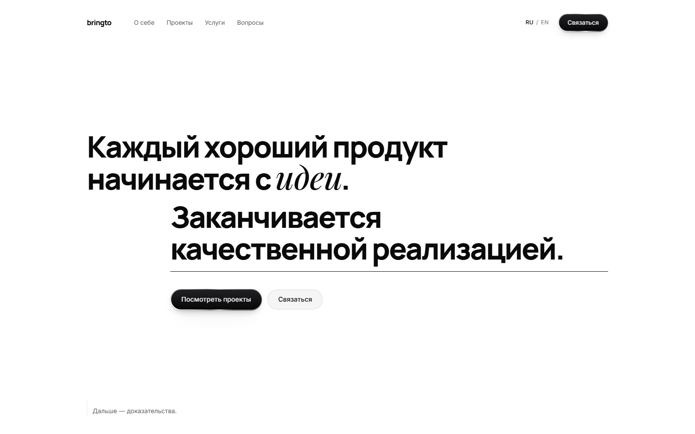
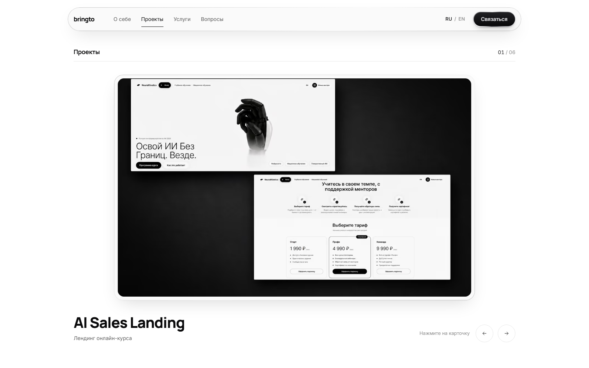
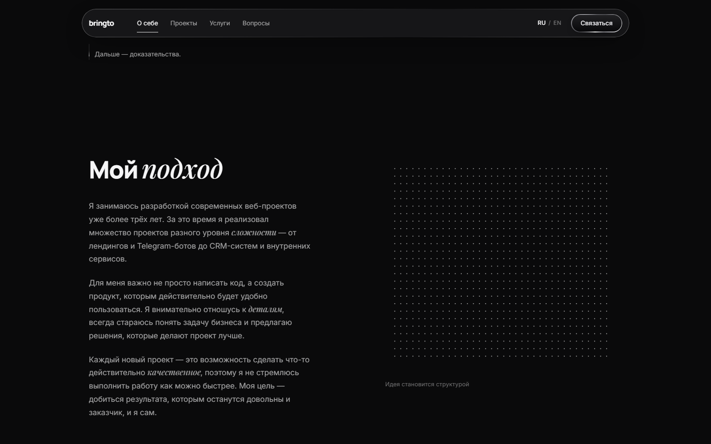
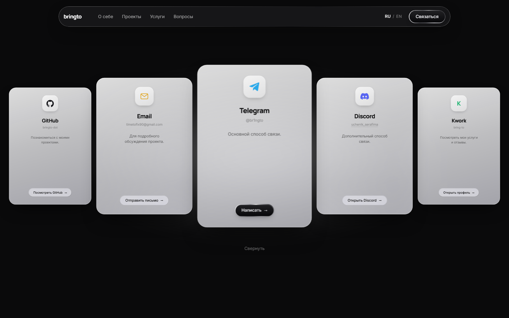

# bringto

**[Живая версия](https://bringto-dot.github.io/portfolio-landing/)**

*[Read in English](README.md)*

Сайт-портфолио, в котором сам сайт и есть главная работа. Он должен удержать
шесть предыдущих проектов — бруталистский бренд одежды, красный японский
ресторан, тёмно-синюю юрпрактику с латунью, синий CRM-дашборд, белый лендинг
курса по ИИ и Telegram-бота — так, чтобы оболочка не спорила ни с одним из них.

Без библиотек компонентов, без конструкторов, без UI-китов. React, TypeScript и
CSS.



## Что показывает этот проект

- **Один фон на весь документ, а не по фону на секцию.** Ни у одной секции здесь
  нет `background`. Под страницей лежит один фиксированный слой, и единственный
  контроллер перекрашивает его по позиции скролла, смешивая то, что просят
  секции сверху и снизу. Этот механизм даёт и поворот из белого в чёрный под
  «Моим подходом», и шесть фирменных цветов в карусели, и дрейф из красного в
  синий под двумя подходами к работе, и инверсию финального экрана. Седьмой цвет
  — это одна строка в секции, а не седьмая копия перехода.

- **Скролл всей страницы не стоит ни одного рендера React.** Контроллер пишет
  CSS-переменные — `--stage`, `--stage-fg`, тон стекла — прямо в корневой элемент
  и не трогает состояние. Всё, чему нужно знать текущий цвет страницы, читает их
  в CSS. Запись пропускается, если значение не изменилось, поэтому полная
  перерисовка фона происходит только пока цвет действительно движется.

- **Передний план выводится, а не задаётся вручную.** Что взять — чёрное или
  белое — решается по относительной яркости фона (WCAG), и переключение
  отцентровано на L≈0.18: это точка, где белый и чёрный текст дают ровно
  одинаковый контраст, а не «50% серого», которое подсказывает интуиция и которое
  выбирает неверный цвет на всём промежутке. Вторичный и третичный уровни текста
  подмешиваются обратно в текущий фон, а не берутся двумя фиксированными серыми —
  именно поэтому одна страница читается на белом, на чёрном, на глубоком красном,
  на синем, на жёлтом и на голубом. Два фиксированных серых, настроенных под
  почти чёрный фон, дают на красном контраст около 1.6:1.

- **Три гарнитуры, и третья — это и есть аргумент.** Manrope — инженерный
  голос, он держит структуру; Inter — интерфейс, и никогда не берёт дисплейный
  кегль; Playfair Display появляется ровно один раз на заголовок, курсивом, на
  слове, которое несёт человеческую половину фразы: «идеи», «помочь», «ваш».
  Сайт держится на мысли *идея, а затем качество реализации* — значит, это
  должна говорить и типографика. Маркер живёт в строке словаря, поэтому
  переводчик двигает акцент, двигая звёздочки.

- **Кнопки, выточенные из CSS.** Основная кнопка — вращающееся хромированное
  кольцо вокруг тёмной плиты с фаской и зеркальной полосой, проходящей по ней
  при наведении. Она выглядит одинаково на всех шести цветах сцены: металлическая
  кромка несёт собственный контраст, а пилюля, которая просто инвертирует фон,
  исчезает, как только фон становится средним по светлоте — а таких из шести
  два. Очевидная альтернатива — WebGL-шейдер на кнопку; это по живому
  графическому контексту на каждую, а браузер держит их около шестнадцати, после
  чего начинает молча убивать самые старые.

- **Оборот карточки непрозрачен намеренно.** `backface-visibility` перестаёт
  быть надёжным, как только что-то в поддереве создаёт контекст наложения, и
  когда он отказывает, лицевая сторона просвечивает сквозь оборот зеркально —
  рендер проекта оказывается прямо под собственным описанием. Оборот сделан
  сплошной плитой, и её цвет — цвет сцены самого проекта, на шаг темнее: каналы
  именно умножаются, а не подмешиваются к чёрному, поэтому у красного проекта
  оборот остаётся красным, а у синего — синим. Под почти чёрным темнее уже
  некуда, и он вместо этого шагает вверх, к белому — важен шаг, а не его
  направление. Плоскость на тон ниже страницы читается как объект и не спорит с
  текстом поверх — чего как раз не удавалось растянутому скриншоту за ним.

- **8.66 МБ рендеров проектов до 0.60 МБ.** Скрипт сборки срезает подпись,
  впечатанную в каждый исходник — она дублирует заголовок, который страница и так
  показывает, и, будучи пикселями, не умеет следовать за переключением языка, —
  приводит всё к единому кадру 16:10, чтобы карточка никогда не letterbox'илась,
  и выдаёт AVIF и WebP в трёх ширинах под `srcset`. Одна карточка на 1280px стоит
  около 22 КБ. Размеры едут в разметке, поэтому сдвига макета нет.

- **Иллюстрация утверждает ровно то же, что её подпись.** Декоративная половина
  «Моего подхода» — поле из 936 точек, которое начинается рассыпанным и по мере
  прохода секции через экран собирается в двенадцатиколоночную сетку макета с
  настоящими средниками: идея становится структурой. Равномерная решётка была бы
  просто точечной текстурой; сетка — это то, что разработчик и правда имеет в
  виду под структурой. Canvas, один rAF-цикл, курсор несёт над полем и линзу, и
  свет.

- **Текст пишется, а не проявляется.** Три абзаца о работе приходят по слову, с
  паузой после точки длиннее, чем после запятой. Намеренно не посимвольно: на 750
  символов любая скорость, читающаяся как печать, — это шесть секунд наблюдения
  за курсором. Каждое слово в DOM с первого кадра, меняется только прозрачность,
  поэтому во время анимации ничего не перевёрстывается, а скринридер получает
  весь текст сразу.

- **Аккордеон, элементом управления которого служит его собственный
  разделитель.** Никакой поворачивающейся галочки и никаких «плюс-минус». Волосок
  под вопросом прочерчивается на всю ширину чёрным, когда строка раскрывается, и
  показывает короткий ведущий штрих при наведении, чтобы механизм был виден до
  клика. Открывающийся шов описывает происходящее лучше, чем иконка рядом.

- **Приглашение, которое превращается в контакт.** Финальная карточка не
  заменяется пятью — она и есть центральная: переворачивается вокруг своей оси в
  Telegram, а остальные четыре уходят из-под неё, по две в каждую сторону. Все
  пять — одна и та же карточка, отмасштабированная вокруг своего центра, поэтому
  ряд держит одни пропорции вместо пяти. Содержимое центрировано: в ряду с
  перекрытием первым пропадает то, что прижато к левому или правому краю, а имя
  посередине не закрывает ничто. Цвет сервиса стоит на карточке размером с точку
  и загорается под ней, когда смотрят именно на неё.

- **Настоящая i18n, а не плагин.** По одному типизированному словарю на язык,
  поэтому пропущенная строка — ошибка компиляции, а не пустое место в языке,
  который никто не проверяет. Выбор определяется при первом визите, хранится в
  `localStorage` и управляет `<title>`, `lang` и мета-описанием. Все три гарнитуры отдают по `@font-face` на юникод-диапазон, так что англоязычный читатель не
  скачивает кириллический сабсет.

## Экраны

| | |
|---|---|
|  |  |



## О поведении

`prefers-reduced-motion` соблюдается везде и не является выключателем, который
гасит анимацию и оставляет сломанный макет: секция с двумя подходами теряет
липкий проход и становится обычным сравнением в две колонки, поле точек рисует
собранную сетку один раз, набираемые абзацы просто на месте, список услуг стоит
на полном контрасте. Без JavaScript страница — обычный видимый контент, а не
колонка пустых секций: `.reveal` прячет себя только под классом, который
добавляется при загрузке.

Карусель отвечает на стрелки, пока она на экране, принимает свайп и держит все
неактивные карточки вне порядка табуляции через `inert`. Кольцо фокуса рисуется
текущим цветом переднего плана, потому что фиксированное синее исчезает на двух
из шести цветов проектов.

## Стек

React 19 + TypeScript, Vite 6, Tailwind CSS v4 (`@tailwindcss/vite`, токены в
`@theme`), `motion` для анимации, `sharp` для конвейера изображений. Manrope,
Inter и Playfair Display, self-hosted — у каждой своя работа, вместо одного
гротеска, которого просят делать все три.

Вся страница — все рендеры проектов, обе гарнитуры, весь JavaScript — весит
около 325 КБ за двадцать два запроса. В gzip это 60 КБ React, 46 КБ `motion`,
20 КБ кода приложения и 8 КБ CSS, разложенные по отдельным чанкам, чтобы правка
текста не инвалидировала закешированный вендорный код.

```bash
npm install
npm run dev       # localhost:5173
npm run build     # tsc --noEmit && vite build
npm run images    # пересобрать public/projects из assets/projects
```

Деплой на GitHub Pages из `main` через `.github/workflows/deploy.yml`.
